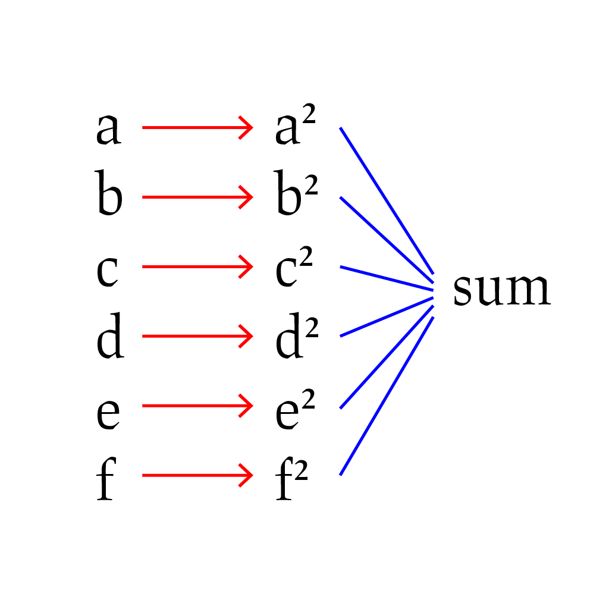

# What the hell is a flatmap? A short guide to list operations in Spark RDD

So I've seen a couple people struggle with the spark RDD API, and that's probably because we're not used to thinking about processing sequential data (such as lists) with the spark library functions `.map()`, `.filter()`, and `.reduce()`. For most of us, used to programming with loops and variables, it can be a bit of a challenge to break out of these patterns and work with these new functions.

Actually these functions are a lot older than Spark, dating back to a style of programming known as Functional Programming, which takes a very different perspective on the way we process data.

## A simple example:

Let's illustrate this by considering a simple problem: we are given a list of numbers as our data, and we wish to compute the sum of all the squares in our dataset.

In an imperative style (which is probably what you're used to, using Python), you'd start by writing a loop to iterate through all elements, and then you'd need to process each element individually by adding its square to an accumulator variable.

In a functional style, instead of loops, our building blocks are the following steps:

1. `map` : Apply a function to each element individually, outputting a new sequence;
1. `reduce` : Combine all the data into one data point, using a "combining function".

(Aside: when we talk about functions here, we are referring to "pure functions", i.e. a way to transform some input data into some return value. Importantly, pure functions should not depend or modify any external data.)

In this case the steps required are evident from the problem statement. We are after all trying to find the *sum* of *squares*, and to do this:

1. We have to *square* every number individually; and
1. We have to *sum* all the results of the previous step.

Visually this is shown in the figure below:



In PySpark we can write this as a combination of the two above steps:

```py
def square(x):
    return x*x

def add(x, y):
    return x + y

dataset.map(square).reduce(add)
```

Or equivalently

```py
dataset.map(lambda x: x*x).reduce(lambda x, y: x+y)
```

